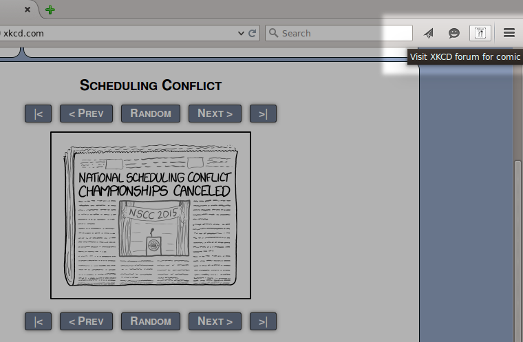

# XKCD Links
Firefox extension that automatically adds a link for (or redirects to) the (often missed and frequently requested) discussion forum page for an individual XKCD comic.

## Example Of Link:

## Example Of Button:

## How It Works:
Either on page load or button click:
- Determine which comic is being viewed
- Perform forum search for comic via Ajax request
- Parse search page DOM and find topic link
- Add forum link to page or redirect to the forum page

## What You Do (if not obtaining via add-on repository):
- Download `http://raw.github.com/crudson/xkcd-forum-linker/master/xkcd.xpi`
- Go to `about:addons`
- Select `extensions`
- Click the Tools icon and select `Install Add-On From File...`
- Navigate to where you saved `xkcd.xpi`
