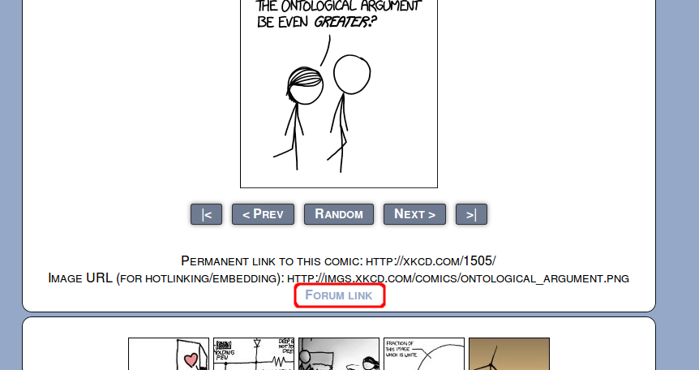

# XKCD Links
Firefox extension that automatically adds a link for (or redirects to) the (often missed and frequently requested) discussion forum page for an individual XKCD comic.

## Example Of Link:

## Example Of Button:

## How:
Either on page load or button click:
- Determine which comic is being viewed
- Perform forum search for comic via Ajax request
- Create DOM node for the response page
- Find topic link in DOM
- Add a link to original page or redirect to the forum page
